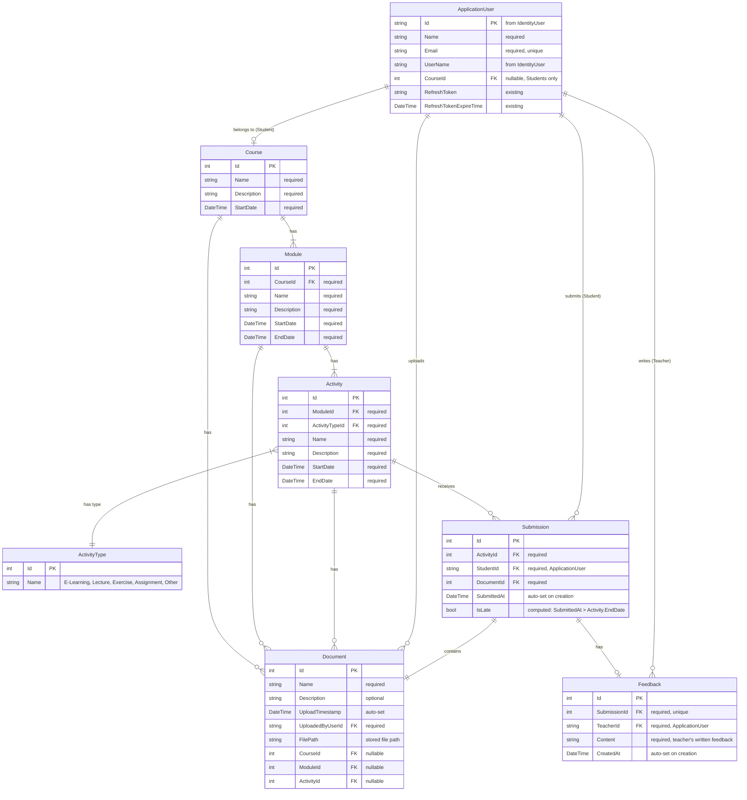

# Lexicon LMS — Complete Project Plan & Scrum Task Board

> **Team:** 5 Developers · **Duration:** 4 Weeks (2 Sprints × 2 Weeks) · **Start:** 2026-03-16  
> **Stack:** .NET · EF Core (Code First) · Blazor Web App · Bootstrap 5 · Clean Architecture

---

## Workspace Architecture Overview

The current boilerplate follows **Clean Architecture** with these projects:

| Project | Role | Key Existing Content |
|---|---|---|
| `Domain.Models` | Entities & configurations | [ApplicationUser](file:///c:/Users/mouni/OneDrive/Desktop/LMS-Gr1/Domain.Models/Entities/ApplicationUser.cs#5-10) (IdentityUser), [JwtSettings](file:///c:/Users/mouni/OneDrive/Desktop/LMS-Gr1/Domain.Models/Configurations/JwtSettings.cs#4-20) |
| `Domain.Contracts` | Repository interfaces | `IRepositoryBase<T>`, `IInternalRepositoryBase<T>`, [IUnitOfWork](file:///c:/Users/mouni/OneDrive/Desktop/LMS-Gr1/Domain.Contracts/Repositories/IUnitOfWork.cs#3-7) |
| `LMS.Services` | Business logic | [AuthService](file:///c:/Users/mouni/OneDrive/Desktop/LMS-Gr1/LMS.Services/AuthService.cs#17-179) (JWT), [ServiceManager](file:///c:/Users/mouni/OneDrive/Desktop/LMS-Gr1/LMS.Services/ServiceManager.cs#5-15) |
| `Service.Contracts` | Service interfaces | [IAuthService](file:///c:/Users/mouni/OneDrive/Desktop/LMS-Gr1/Service.Contracts/IAuthService.cs#5-12), [IServiceManager](file:///c:/Users/mouni/OneDrive/Desktop/LMS-Gr1/Service.Contracts/IServiceManager.cs#2-6) |
| `LMS.Infractructure` | Data access & EF Core | [ApplicationDbContext](file:///c:/Users/mouni/OneDrive/Desktop/LMS-Gr1/LMS.Infractructure/Data/ApplicationDbContext.cs#10-14), `RepositoryBase<T>`, [UnitOfWork](file:///c:/Users/mouni/OneDrive/Desktop/LMS-Gr1/LMS.Infractructure/Repositories/UnitOfWork.cs#9-13), [MapperProfile](file:///c:/Users/mouni/OneDrive/Desktop/LMS-Gr1/LMS.Infractructure/Data/MapperProfile.cs#9-13) |
| `LMS.API` | REST API host | [Program.cs](file:///c:/Users/mouni/OneDrive/Desktop/LMS-Gr1/LMS.API/Program.cs), extensions (CORS, Swagger, Auth, Identity), [DataSeedHostingService](file:///c:/Users/mouni/OneDrive/Desktop/LMS-Gr1/LMS.API/Services/DataSeedHostingService.cs#17-123) |
| `LMS.Presentation` | API Controllers | [AuthController](file:///c:/Users/mouni/OneDrive/Desktop/LMS-Gr1/LMS.Presentation/Controllers/AuthController.cs#17-21), [TokenController](file:///c:/Users/mouni/OneDrive/Desktop/LMS-Gr1/LMS.Presentation/Controllers/TokenController.cs#9-24) |
| `LMS.Shared` | DTOs shared across layers | Auth DTOs (`TokenDto`, `UserAuthDto`, `UserRegistrationDto`) |
| `LMS.Blazor` | Frontend (Server + Client WASM) | Identity pages (Login etc.), BFF proxy, [ClientApiService](file:///c:/Users/mouni/OneDrive/Desktop/LMS-Gr1/LMS.Blazor/LMS.Blazor.Client/Services/ClientApiService.cs#6-39), Layout/Nav |

---

## Step 1: ER Diagram

### Entity-Relationship Diagram (Mermaid)



### Entity Details & Mapping to Workspace

#### [ApplicationUser](file:///c:/Users/mouni/OneDrive/Desktop/LMS-Gr1/Domain.Models/Entities/ApplicationUser.cs#5-10) → [ApplicationUser.cs](file:///c:/Users/mouni/OneDrive/Desktop/LMS-Gr1/Domain.Models/Entities/ApplicationUser.cs)

**Existing** — Extends `IdentityUser`. Must **add**:
- `string Name` — full name (required)
- `int? CourseId` — FK to Course (nullable, only for Students)
- Navigation: `Course? Course`, `ICollection<Submission>? Submissions`, `ICollection<Feedback>? Feedbacks`

> [!IMPORTANT]
> Roles ("Teacher" / "Student") are managed **exclusively** via ASP.NET Identity's built-in role system (`IdentityRole`, `UserManager.AddToRoleAsync`). **Do NOT add a [Role](file:///c:/Users/mouni/OneDrive/Desktop/LMS-Gr1/LMS.API/Services/DataSeedHostingService.cs#64-75) string column** to [ApplicationUser](file:///c:/Users/mouni/OneDrive/Desktop/LMS-Gr1/Domain.Models/Entities/ApplicationUser.cs#5-10). The [DataSeedHostingService](file:///c:/Users/mouni/OneDrive/Desktop/LMS-Gr1/LMS.API/Services/DataSeedHostingService.cs#17-123) already seeds both roles.

#### `Course` → **[NEW]** `Domain.Models/Entities/Course.cs`

| Attribute | Type | Notes |
|---|---|---|
| [Id](file:///c:/Users/mouni/OneDrive/Desktop/LMS-Gr1/LMS.API/Extensions/AuthServiceExtension.cs#52-69) | `int` | PK, auto-increment |
| `Name` | `string` | Required. E.g. ".NET 2026" |
| `Description` | `string` | Required |
| `StartDate` | `DateTime` | Required |
| Navigation | `ICollection<Module>` | One-to-many |
| Navigation | `ICollection<ApplicationUser>` | Students in this course |
| Navigation | `ICollection<Document>` | Course-level documents |

#### `Module` → **[NEW]** `Domain.Models/Entities/Module.cs`

| Attribute | Type | Notes |
|---|---|---|
| [Id](file:///c:/Users/mouni/OneDrive/Desktop/LMS-Gr1/LMS.API/Extensions/AuthServiceExtension.cs#52-69) | `int` | PK |
| `CourseId` | `int` | FK → Course (required) |
| `Name` | `string` | Required |
| `Description` | `string` | Required |
| `StartDate` | `DateTime` | Must be ≥ Course.StartDate |
| `EndDate` | `DateTime` | Must not overlap other modules in same course |
| Navigation | `Course` | Required |
| Navigation | `ICollection<Activity>` | One-to-many |
| Navigation | `ICollection<Document>` | Module-level documents |

#### `Activity` → **[NEW]** `Domain.Models/Entities/Activity.cs`

| Attribute | Type | Notes |
|---|---|---|
| [Id](file:///c:/Users/mouni/OneDrive/Desktop/LMS-Gr1/LMS.API/Extensions/AuthServiceExtension.cs#52-69) | `int` | PK |
| `ModuleId` | `int` | FK → Module (required) |
| `ActivityTypeId` | `int` | FK → ActivityType (required) |
| `Name` | `string` | Required |
| `Description` | `string` | Required |
| `StartDate` | `DateTime` | Must be within module date range |
| `EndDate` | `DateTime` | Must not overlap within module |
| Navigation | `Module` | Required |
| Navigation | `ActivityType` | Required |
| Navigation | `ICollection<Document>` | Activity-level documents |
| Navigation | `ICollection<Submission>` | Submissions for this activity (Assignment type) |

#### `ActivityType` → **[NEW]** `Domain.Models/Entities/ActivityType.cs`

| Attribute | Type | Notes |
|---|---|---|
| [Id](file:///c:/Users/mouni/OneDrive/Desktop/LMS-Gr1/LMS.API/Extensions/AuthServiceExtension.cs#52-69) | `int` | PK |
| `Name` | `string` | E-Learning, Lecture, Exercise, Assignment, Other |
| Navigation | `ICollection<Activity>` | Activities of this type |

> Seeded via [DataSeedHostingService](file:///c:/Users/mouni/OneDrive/Desktop/LMS-Gr1/LMS.API/Services/DataSeedHostingService.cs#17-123). Keeps activity type data-driven.

#### `Document` → **[NEW]** `Domain.Models/Entities/Document.cs`

| Attribute | Type | Notes |
|---|---|---|
| [Id](file:///c:/Users/mouni/OneDrive/Desktop/LMS-Gr1/LMS.API/Extensions/AuthServiceExtension.cs#52-69) | `int` | PK |
| `Name` | `string` | Required |
| `Description` | `string?` | Optional |
| `UploadTimestamp` | `DateTime` | Auto-set on creation |
| `UploadedByUserId` | `string` | FK → ApplicationUser |
| `FilePath` | `string` | Server file storage path (single source of truth for file location) |
| `CourseId` | `int?` | Nullable FK → Course |
| `ModuleId` | `int?` | Nullable FK → Module |
| `ActivityId` | `int?` | Nullable FK → Activity |
| Navigation | [ApplicationUser](file:///c:/Users/mouni/OneDrive/Desktop/LMS-Gr1/Domain.Models/Entities/ApplicationUser.cs#5-10) | Uploader |
| Navigation | `Course?`, `Module?`, `Activity?` | Parent entity |

> [!NOTE]
> A Document belongs to **exactly one** parent (Course OR Module OR Activity). This is enforced at the application level — at least one FK must be non-null.

#### `Submission` → **[NEW]** `Domain.Models/Entities/Submission.cs`

Tracks a student submitting an assignment. **Does NOT duplicate `FilePath`** — it references a `Document` entity which owns the file.

| Attribute | Type | Notes |
|---|---|---|
| [Id](file:///c:/Users/mouni/OneDrive/Desktop/LMS-Gr1/LMS.API/Extensions/AuthServiceExtension.cs#52-69) | `int` | PK |
| `ActivityId` | `int` | FK → Activity (required, must be an Assignment-type activity) |
| `StudentId` | `string` | FK → ApplicationUser (the student who submitted) |
| `DocumentId` | `int` | FK → Document (the uploaded file — `FilePath` lives here, not duplicated) |
| `SubmittedAt` | `DateTime` | Auto-set on creation |
| `IsLate` | `bool` | Computed at creation: `SubmittedAt > Activity.EndDate` |
| Navigation | `Activity` | The assignment being submitted to |
| Navigation | [ApplicationUser](file:///c:/Users/mouni/OneDrive/Desktop/LMS-Gr1/Domain.Models/Entities/ApplicationUser.cs#5-10) | The student |
| Navigation | `Document` | The submitted file |
| Navigation | `Feedback?` | Optional teacher feedback on this submission |

> [!WARNING]
> `IsLate` should be computed by the service layer when creating the submission, comparing `SubmittedAt` against `Activity.EndDate`. It is stored as a column (not a computed property) so it can be queried/filtered efficiently.

#### `Feedback` → **[NEW]** `Domain.Models/Entities/Feedback.cs`

Teacher feedback on a student's submission. One-to-one with `Submission`.

| Attribute | Type | Notes |
|---|---|---|
| [Id](file:///c:/Users/mouni/OneDrive/Desktop/LMS-Gr1/LMS.API/Extensions/AuthServiceExtension.cs#52-69) | `int` | PK |
| `SubmissionId` | `int` | FK → Submission (required, **unique** — one feedback per submission) |
| `TeacherId` | `string` | FK → ApplicationUser (the teacher who wrote feedback) |
| `Content` | `string` | Required — the written feedback text |
| `CreatedAt` | `DateTime` | Auto-set on creation |
| Navigation | `Submission` | The submission being reviewed |
| Navigation | [ApplicationUser](file:///c:/Users/mouni/OneDrive/Desktop/LMS-Gr1/Domain.Models/Entities/ApplicationUser.cs#5-10) | The teacher |

### Validation Rules (from PDF)
1. **Modules** must not overlap each other within a course and must not extend outside the course dates
2. **Activities** must not overlap within a module and must be within the module's date range
3. All students belong to **exactly one** course
4. **Submissions** can only target Assignment-type activities
5. **IsLate** is set automatically: `true` when `SubmittedAt > Activity.EndDate`
6. **Feedback** is one-to-one with Submission (unique constraint on `SubmissionId`)

---

## Step 2: 4-Week Task Breakdown

### Developers
| Code | Name |
|---|---|
| **D1** | Developer 1 — Backend Lead |
| **D2** | Developer 2 — Backend/Infra |
| **D3** | Developer 3 — Full-Stack |
| **D4** | Developer 4 — Frontend Lead |
| **D5** | Developer 5 — Frontend/UX |

---

### 🏃 Sprint 1 — Week 1 (Mar 16–20): Foundation & Database

> **Goal:** ER diagram approved → Domain models → Database → Basic auth working

| # | Task | Assigned | Effort | File/Folder | Depends On |
|---|---|---|---|---|---|
| 1.1 | **Finalize & submit ER diagram** for teacher approval | D1 | 0.5d | This document | — |
| 1.2 | **Create `Course` entity** with data annotations | D1 | 0.5d | `Domain.Models/Entities/Course.cs` | 1.1 |
| 1.3 | **Create `Module` entity** with FK to Course | D1 | 0.5d | `Domain.Models/Entities/Module.cs` | 1.1 |
| 1.4 | **Create `Activity` entity** with FK to Module & ActivityType | D2 | 0.5d | `Domain.Models/Entities/Activity.cs` | 1.1 |
| 1.5 | **Create `ActivityType` entity** (lookup table) | D2 | 0.5d | `Domain.Models/Entities/ActivityType.cs` | 1.1 |
| 1.6 | **Create `Document` entity** with polymorphic FKs | D2 | 0.5d | `Domain.Models/Entities/Document.cs` | 1.1 |
| 1.7 | **Extend [ApplicationUser](file:///c:/Users/mouni/OneDrive/Desktop/LMS-Gr1/Domain.Models/Entities/ApplicationUser.cs#5-10)** — add `Name`, `CourseId` FK, Submission/Feedback navigations | D1 | 0.5d | [Domain.Models/Entities/ApplicationUser.cs](file:///c:/Users/mouni/OneDrive/Desktop/LMS-Gr1/Domain.Models/Entities/ApplicationUser.cs) | 1.1 |
| 1.8 | **Create `Submission` entity** — FK to Activity, Student, Document; `SubmittedAt`, `IsLate` | D4 | 0.5d | `Domain.Models/Entities/Submission.cs` | 1.4, 1.6 |
| 1.9 | **Create `Feedback` entity** — FK to Submission, Teacher; `Content`, `CreatedAt`; unique on SubmissionId | D4 | 0.5d | `Domain.Models/Entities/Feedback.cs` | 1.8 |
| 1.10 | **Configure EF relationships** (Fluent API in `OnModelCreating`) for all 8 entities | D2 | 1d | [LMS.Infractructure/Data/ApplicationDbContext.cs](file:///c:/Users/mouni/OneDrive/Desktop/LMS-Gr1/LMS.Infractructure/Data/ApplicationDbContext.cs) | 1.2–1.9 |
| 1.11 | **Add DbSets** for all new entities to [ApplicationDbContext](file:///c:/Users/mouni/OneDrive/Desktop/LMS-Gr1/LMS.Infractructure/Data/ApplicationDbContext.cs#10-14) | D2 | 0.5d | [LMS.Infractructure/Data/ApplicationDbContext.cs](file:///c:/Users/mouni/OneDrive/Desktop/LMS-Gr1/LMS.Infractructure/Data/ApplicationDbContext.cs) | 1.10 |
| 1.12 | **Run initial EF migration** & verify database schema | D2 | 0.5d | `LMS.Infractructure/Migrations/` | 1.11 |
| 1.13 | **Create repository interfaces** (`ICourseRepository`, `IModuleRepository`, `IActivityRepository`, `IDocumentRepository`, `ISubmissionRepository`, `IFeedbackRepository`) | D3 | 1d | `Domain.Contracts/Repositories/` | 1.2–1.9 |
| 1.14 | **Implement concrete repositories** for all entities | D3 | 1d | `LMS.Infractructure/Repositories/` | 1.13, 1.11 |
| 1.15 | **Register repositories** in DI and update `IUnitOfWork` | D3 | 0.5d | `LMS.API/Extensions/ServiceExtensions.cs`, `Domain.Contracts/Repositories/IUnitOfWork.cs` | 1.14 |
| 1.16 | **Expand `DataSeedHostingService`** — seed ActivityTypes, demo Course, Modules, Activities | D3 | 1d | `LMS.API/Services/DataSeedHostingService.cs` | 1.12 |
| 1.17 | **Verify Login flow works** end-to-end with existing auth boilerplate | D4 | 0.5d | `LMS.Blazor/LMS.Blazor/Components/Account/Pages/Login.razor` | — |
| 1.18 | **Update `UserRegistrationDto`** — add `Name` field | D4 | 0.5d | `LMS.Shared/DTOs/AuthDtos/UserRegistrationDto.cs` | 1.7 |
| 1.19 | **Update `MapperProfile`** for new user fields | D4 | 0.5d | `LMS.Infractructure/Data/MapperProfile.cs` | 1.18 |
| 1.20 | **Setup project README** with build/run instructions & Git branching strategy (main → development → feature branches) | D5 | 0.5d | `README.md` | — |
| 1.21 | **Design UI wireframes/mockups** for Teacher and Student dashboards (layout planning) | D5 | 1.5d | — | — |
| 1.22 | **Setup Bootstrap 5 theme** — branding, color palette, common component styles | D5 | 1d | `LMS.Blazor/LMS.Blazor.Client/wwwroot/` | — |

---

### 🏃 Sprint 1 — Week 2 (Mar 23–27): Core Services & API + Frontend Scaffolding

> **Goal:** Full CRUD API for all entities → Initial Blazor pages scaffolded

| # | Task | Assigned | Effort | File/Folder | Depends On |
|---|---|---|---|---|---|
| 2.1 | **Create DTOs** for Course (`CourseDto`, `CourseCreateDto`, `CourseUpdateDto`) | D1 | 0.5d | `LMS.Shared/DTOs/` | 1.2 |
| 2.2 | **Create DTOs** for Module (`ModuleDto`, `ModuleCreateDto`, `ModuleUpdateDto`) | D1 | 0.5d | `LMS.Shared/DTOs/` | 1.3 |
| 2.3 | **Create DTOs** for Activity (`ActivityDto`, `ActivityCreateDto`, `ActivityUpdateDto`) | D1 | 0.5d | `LMS.Shared/DTOs/` | 1.4 |
| 2.4 | **Create service interfaces** (`ICourseService`, `IModuleService`, `IActivityService`) | D1 | 0.5d | `Service.Contracts/` | 2.1–2.3 |
| 2.5 | **Implement `CourseService`** — CRUD + validation (date constraints) | D1 | 1d | `LMS.Services/CourseService.cs` | 2.4, 1.14 |
| 2.6 | **Implement `ModuleService`** — CRUD + overlap validation | D2 | 1d | `LMS.Services/ModuleService.cs` | 2.4, 1.14 |
| 2.7 | **Implement `ActivityService`** — CRUD + overlap validation | D2 | 1d | `LMS.Services/ActivityService.cs` | 2.4, 1.14 |
| 2.8 | **Create DTOs** for Submission (`SubmissionDto`, `SubmissionCreateDto`) and Feedback (`FeedbackDto`, `FeedbackCreateDto`) | D1 | 0.5d | `LMS.Shared/DTOs/` | 1.8, 1.9 |
| 2.9 | **Create `ISubmissionService`** interface & **implement `SubmissionService`** — create submission, compute `IsLate`, list by activity/student | D3 | 1d | `Service.Contracts/ISubmissionService.cs`, `LMS.Services/SubmissionService.cs` | 2.8, 1.14 |
| 2.10 | **Create `IFeedbackService`** interface & **implement `FeedbackService`** — create feedback (one per submission), get by submission | D3 | 1d | `Service.Contracts/IFeedbackService.cs`, `LMS.Services/FeedbackService.cs` | 2.8, 2.9 |
| 2.11 | **Update `ServiceManager`** — register all new services (Course, Module, Activity, Submission, Feedback) | D2 | 0.5d | `LMS.Services/ServiceManager.cs`, `Service.Contracts/IServiceManager.cs` | 2.5–2.7, 2.9, 2.10 |
| 2.12 | **Update `MapperProfile`** — add all DTO↔Entity mappings including Submission & Feedback | D2 | 0.5d | `LMS.Infractructure/Data/MapperProfile.cs` | 2.1–2.3, 2.8 |
| 2.13 | **Create `CoursesController`** — CRUD endpoints with `[Authorize]` | D3 | 0.5d | `LMS.Presentation/Controllers/CoursesController.cs` | 2.5 |
| 2.14 | **Create `ModulesController`** — CRUD endpoints nested under course | D3 | 0.5d | `LMS.Presentation/Controllers/ModulesController.cs` | 2.6 |
| 2.15 | **Create `ActivitiesController`** — CRUD endpoints nested under module | D3 | 0.5d | `LMS.Presentation/Controllers/ActivitiesController.cs` | 2.7 |
| 2.16 | **Create `SubmissionsController`** — POST submit, GET by activity, GET by student | D3 | 0.5d | `LMS.Presentation/Controllers/SubmissionsController.cs` | 2.9 |
| 2.17 | **Create `FeedbackController`** — POST create, GET by submission | D3 | 0.5d | `LMS.Presentation/Controllers/FeedbackController.cs` | 2.10 |
| 2.18 | **Extend `IApiService`** — add `PostAsync`, `PutAsync`, `DeleteAsync` methods | D4 | 0.5d | `LMS.Blazor/LMS.Blazor.Client/Services/IApiService.cs` | — |
| 2.19 | **Update `ClientApiService`** — implement all HTTP methods | D4 | 0.5d | `LMS.Blazor/LMS.Blazor.Client/Services/ClientApiService.cs` | 2.18 |
| 2.20 | **Scaffold Teacher Dashboard page** — list all courses | D4 | 1d | `LMS.Blazor/LMS.Blazor.Client/Pages/Teacher/Dashboard.razor` | 2.18 |
| 2.21 | **Scaffold Student Dashboard page** — show enrolled course & modules | D5 | 1d | `LMS.Blazor/LMS.Blazor.Client/Pages/Student/Dashboard.razor` | 2.18 |
| 2.22 | **Update `NavMenu.razor`** — role-based navigation (Teacher vs Student) | D5 | 0.5d | `LMS.Blazor/LMS.Blazor.Client/Layout/NavMenu.razor` | — |
| 2.23 | **Scaffold Course Detail page** — show modules within a course | D4 | 1d | `LMS.Blazor/LMS.Blazor.Client/Pages/Teacher/CourseDetail.razor` | 2.20 |
| 2.24 | **Scaffold Course Create/Edit form** (Bootstrap modal or page) | D5 | 1d | `LMS.Blazor/LMS.Blazor.Client/Pages/Teacher/CourseForm.razor` | 2.20 |
| 2.25 | **Create `UserService`** for teacher to manage users (list, create, edit) | D2 | 0.5d | `LMS.Services/UserService.cs`, `Service.Contracts/IUserService.cs` | 1.18 |

---

### 🏃 Sprint 2 — Week 3 (Mar 30–Apr 3): Frontend-Backend Integration & Documents

> **Goal:** Full UI for all use cases → Document upload/download → Student-specific views

| # | Task | Assigned | Effort | File/Folder | Depends On |
|---|---|---|---|---|---|
| 3.1 | **Teacher: Module Create/Edit form** with date validation | D1 | 1d | `LMS.Blazor/LMS.Blazor.Client/Pages/Teacher/ModuleForm.razor` | 2.14 |
| 3.2 | **Teacher: Activity Create/Edit form** with type dropdown & date validation | D1 | 1d | `LMS.Blazor/LMS.Blazor.Client/Pages/Teacher/ActivityForm.razor` | 2.15 |
| 3.3 | **Teacher: User management page** — list, create, assign to course | D2 | 1d | `LMS.Blazor/LMS.Blazor.Client/Pages/Teacher/UserManagement.razor` | 2.25 |
| 3.4 | **Create `DocumentService`** — upload, download, list, delete logic | D2 | 1d | `LMS.Services/DocumentService.cs`, `Service.Contracts/IDocumentService.cs` | 1.6 |
| 3.5 | **Create `DocumentsController`** — upload endpoint (multipart/form-data), download, list | D2 | 1d | `LMS.Presentation/Controllers/DocumentsController.cs` | 3.4 |
| 3.6 | **Configure file storage** — `wwwroot/uploads/` or a configurable path, add to `appsettings.json` | D3 | 0.5d | `LMS.API/appsettings.json`, `LMS.Services/DocumentService.cs` | 3.4 |
| 3.7 | **Document upload component** — reusable Blazor component with drag & drop | D3 | 1d | `LMS.Blazor/LMS.Blazor.Client/Components/DocumentUpload.razor` | 3.5 |
| 3.8 | **Document list/download component** — show documents for any entity | D3 | 1d | `LMS.Blazor/LMS.Blazor.Client/Components/DocumentList.razor` | 3.5 |
| 3.9 | **Student: Course overview page** — see course info & classmates | D4 | 1d | `LMS.Blazor/LMS.Blazor.Client/Pages/Student/CourseOverview.razor` | 2.21 |
| 3.10 | **Student: Module schedule view** — see activities per module (module schema) | D4 | 1d | `LMS.Blazor/LMS.Blazor.Client/Pages/Student/ModuleSchedule.razor` | 2.21 |
| 3.11 | **Student: Assignment submission page** — list assignments, upload file to create `Submission` (via `SubmissionsController`), show status (pending/submitted/late) with `IsLate` flag | D4 | 1.5d | `LMS.Blazor/LMS.Blazor.Client/Pages/Student/Assignments.razor` | 2.16, 3.7, 3.8 |
| 3.12 | **Teacher: Document management** — upload/view docs at Course, Module, Activity level | D5 | 1d | `LMS.Blazor/LMS.Blazor.Client/Pages/Teacher/DocumentManagement.razor` | 3.7, 3.8 |
| 3.13 | **Teacher: Submissions dashboard** — view all submissions for an activity, see `IsLate` badges, download submitted documents | D5 | 1d | `LMS.Blazor/LMS.Blazor.Client/Pages/Teacher/Submissions.razor` | 2.16, 3.11 |
| 3.14 | **Teacher: Write Feedback** — form to write `Content` for a specific `Submission`, POST via `FeedbackController` | D5 | 1d | `LMS.Blazor/LMS.Blazor.Client/Pages/Teacher/FeedbackForm.razor` | 2.17, 3.13 |
| 3.15 | **Student: View Feedback** — display teacher `Feedback.Content` and `CreatedAt` on the student's assignment page | D4 | 0.5d | `LMS.Blazor/LMS.Blazor.Client/Pages/Student/Assignments.razor` | 2.17, 3.11 |
| 3.16 | **Update BFF proxy controller** — add proxy routes for Document, Submission, and Feedback endpoints | D1 | 0.5d | `LMS.Blazor/LMS.Blazor/Controllers/` | 3.5, 2.16, 2.17 |
| 3.17 | **Add API authorization policies** — Teacher-only endpoints (Feedback create, user management) vs Student-accessible (Submission create, view own feedback) | D1 | 0.5d | `LMS.Presentation/Controllers/`, `LMS.API/Extensions/` | — |

---

### 🏃 Sprint 2 — Week 4 (Apr 6–10): Testing, Bug Fixing, Polish & Demo Prep

> **Goal:** Stable, polished application → Sprint demo ready

| # | Task | Assigned | Effort | File/Folder | Depends On |
|---|---|---|---|---|---|
| 4.1 | **End-to-end testing** — Teacher flow: Login → Create Course → Add Modules → Add Activities → Upload Documents → View Submissions → Write Feedback | D1 | 1d | — | All Week 3 |
| 4.2 | **End-to-end testing** — Student flow: Login → See Course → See Schedule → View/Download Documents → Submit Assignment → View Feedback | D2 | 1d | — | All Week 3 |
| 4.3 | **Fix bugs** from E2E testing (backend) | D1 | 1.5d | Various | 4.1, 4.2 |
| 4.4 | **Fix bugs** from E2E testing (frontend) | D4 | 1.5d | Various | 4.1, 4.2 |
| 4.5 | **Date overlap validation** — ensure module/activity overlap rules are enforced in both UI and API | D2 | 1d | `LMS.Services/ModuleService.cs`, `LMS.Services/ActivityService.cs` | 4.1 |
| 4.6 | **UI polish: Responsive layout** — test and fix on mobile/tablet viewports | D5 | 1d | `LMS.Blazor/LMS.Blazor.Client/` | — |
| 4.7 | **UI polish: Loading states & error handling** — spinners, toasts, empty states | D4 | 1d | `LMS.Blazor/LMS.Blazor.Client/` | — |
| 4.8 | **UI polish: Consistent Bootstrap styling** — "Less is more" review pass | D5 | 1d | `LMS.Blazor/LMS.Blazor.Client/` | — |
| 4.9 | **Seed realistic demo data** — courses, modules, activities, documents, submissions, feedback, users for demo | D3 | 1d | `LMS.API/Services/DataSeedHostingService.cs` | — |
| 4.10 | **Write unit tests** (optional/desirable) — service layer validation logic (including `IsLate` computation, feedback uniqueness) | D3 | 1.5d | New `LMS.Tests/` project | — |
| 4.11 | **Code cleanup** — remove demo pages (`Counter.razor`, `Weather.razor`, `DemoAuth.razor`), unused code | D3 | 0.5d | `LMS.Blazor/LMS.Blazor.Client/Pages/` | — |
| 4.12 | **Prepare Sprint Demo** — talking points, demo script, ensure clean database state | D1, D5 | 0.5d | — | All |
| 4.13 | **Final merge & deploy** — merge all feature branches → development → main | D1 | 0.5d | Git | All |

---

## Step 3: Developer Assignments Summary

### Week 1 — Foundation & Database

| Developer | Tasks | Focus Area |
|---|---|---|
| **D1** | 1.1, 1.2, 1.3, 1.7 | ER diagram approval, Course/Module/User entities |
| **D2** | 1.4, 1.5, 1.6, 1.10, 1.11, 1.12 | Activity/ActivityType/Document entities, EF config, DbSets, migration |
| **D3** | 1.13, 1.14, 1.15, 1.16 | Repository layer (all 6 repos), DI registration, seeding |
| **D4** | 1.8, 1.9, 1.17, 1.18, 1.19 | Submission/Feedback entities, verify login, update auth DTOs/mapper |
| **D5** | 1.20, 1.21, 1.22 | README, wireframes, Bootstrap theme |

> **Dependency flow:** D1 does ER (1.1) first → unblocks D1/D2/D4 entity work → D2 configures EF (after all entities including D4's Submission/Feedback) → D3 builds repositories → D3 seeds data. D5 works independently on design.

### Week 2 — Core Services & API + Frontend Scaffolding

| Developer | Tasks | Focus Area |
|---|---|---|
| **D1** | 2.1, 2.2, 2.3, 2.4, 2.5, 2.8 | Course/Module/Activity DTOs, service interfaces, CourseService, Submission/Feedback DTOs |
| **D2** | 2.6, 2.7, 2.11, 2.12, 2.25 | ModuleService, ActivityService, ServiceManager, mapper, UserService |
| **D3** | 2.9, 2.10, 2.13, 2.14, 2.15, 2.16, 2.17 | SubmissionService, FeedbackService, all 5 API controllers |
| **D4** | 2.18, 2.19, 2.20, 2.23 | Blazor API client, Teacher dashboard, course detail |
| **D5** | 2.21, 2.22, 2.24 | Student dashboard, nav menu, course form |

> **Dependency flow:** D1 creates DTOs (Mon) → D1/D2 build services (Mon–Wed) → D3 builds Submission/Feedback services & all controllers (Tue–Fri) → D4/D5 scaffold UI pages in parallel using mock data, connect by Thu–Fri.

### Week 3 — Frontend-Backend Integration, Documents & Submission/Feedback UI

| Developer | Tasks | Focus Area |
|---|---|---|
| **D1** | 3.1, 3.2, 3.16, 3.17 | Teacher forms, BFF proxy updates (incl. Submission/Feedback routes), auth policies |
| **D2** | 3.3, 3.4, 3.5 | User management, Document service & controller |
| **D3** | 3.6, 3.7, 3.8 | File storage config, document Blazor components |
| **D4** | 3.9, 3.10, 3.11, 3.15 | Student pages: course overview, module schedule, submit assignment, view feedback |
| **D5** | 3.12, 3.13, 3.14 | Teacher: document management, submissions dashboard, write feedback form |

> **Dependency flow:** D2 builds DocumentService/Controller (Mon–Tue) → D3 builds upload/download components (Tue–Wed) → D4 builds student submission page using document components + SubmissionsController (Wed–Thu) → D5 builds teacher submissions dashboard + feedback form using FeedbackController (Thu–Fri). D4 adds feedback viewing after D5's feedback form is ready.

### Week 4 — Testing, Bug Fixing, Polish & Demo

| Developer | Tasks | Focus Area |
|---|---|---|
| **D1** | 4.1, 4.3, 4.12, 4.13 | E2E testing (teacher incl. feedback), bug fixes, demo prep, final merge |
| **D2** | 4.2, 4.5 | E2E testing (student incl. submission + view feedback), date validation hardening |
| **D3** | 4.9, 4.10, 4.11 | Demo data seeding (incl. submissions/feedback), unit tests, code cleanup |
| **D4** | 4.4, 4.7 | Frontend bug fixes, loading/error states |
| **D5** | 4.6, 4.8, 4.12 | Responsive design, Bootstrap polish, demo prep |

> **Dependency flow:** D1/D2 do E2E testing including full Submission→Feedback flow (Mon–Tue) → generate bug list → D1/D3 fix backend, D4 fixes frontend (Tue–Thu). D5 polishes UI throughout. Everyone converges on demo prep Friday.

---

## Sprint Deliverables Checklist

### Sprint 1 Demo (End of Week 2)
- [ ] ER diagram approved ✅
- [ ] Database created with all 8 entities (incl. Submission & Feedback) and relationships
- [ ] Login/Logout working for Teacher and Student roles
- [ ] API: Full CRUD for Courses, Modules, Activities via Swagger
- [ ] API: Submission & Feedback endpoints functional via Swagger
- [ ] Blazor: Teacher dashboard showing courses
- [ ] Blazor: Student dashboard showing enrolled course
- [ ] Blazor: Course detail page with modules
- [ ] Blazor: Course create/edit form

### Sprint 2 Demo (End of Week 4)
- [ ] Teacher can manage users (create, edit, assign to course)
- [ ] Teacher can create/edit modules and activities with date validation
- [ ] Teacher can upload documents to courses/modules/activities
- [ ] Teacher can view student submissions with `IsLate` status badges
- [ ] Teacher can write feedback on individual submissions
- [ ] Student can see course, classmates, module schedule
- [ ] Student can view/download documents
- [ ] Student can submit assignments and see submission status (pending/submitted/late)
- [ ] Student can view teacher feedback on their submissions
- [ ] Responsive, polished UI with Bootstrap 5
- [ ] Clean demo data seeded (incl. sample submissions & feedback)
- [ ] All feature branches merged to main

---

## Git Branching Strategy

```
main ← development ← feature/[task-number]-[short-description]
```

| Branch | Purpose |
|---|---|
| `main` | Production-ready, only merged after sprint demo |
| `development` | Integration branch, all features merge here |
| `feature/1.2-course-entity` | Example feature branch for task 1.2 |

> [!TIP]
> PRs should target `development`. At least one team member reviews before merge. Merge `development` → `main` only after sprint demo.
